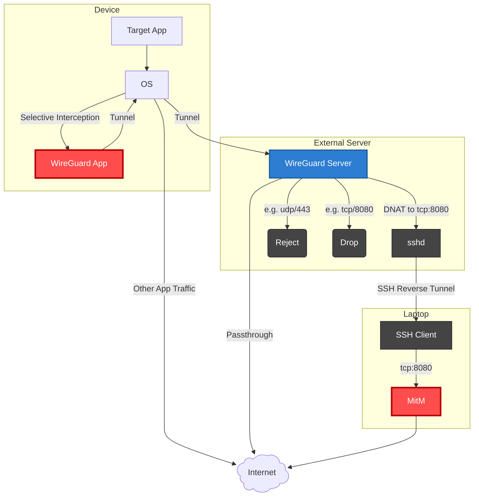
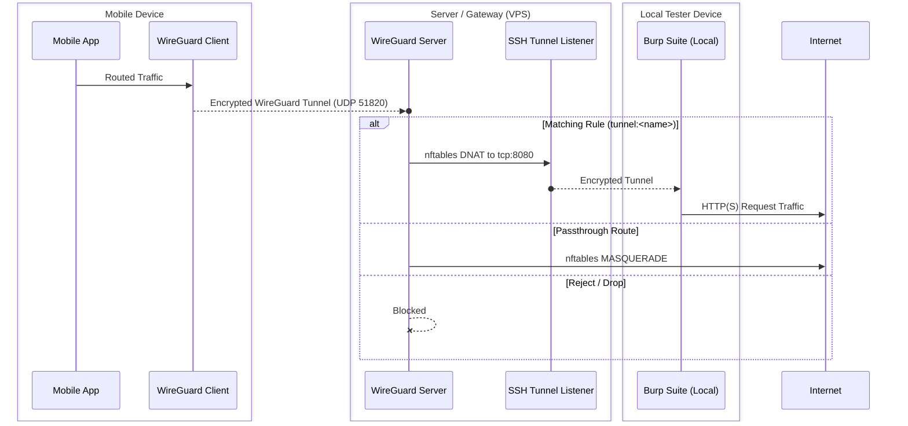
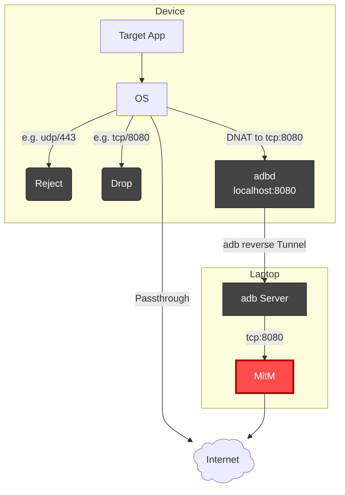

# netlane

netlane routes mobile device traffic during security analysis.
Rules decide per connection whether traffic is forwarded to a local tool such as Burp Suite, passed through to the internet, or dropped/rejected.
The idea behind this is to simplify traditional error-prone network interception setups encompassing VPNs, firewall rules and tunnels with a config file for most test scenarios.

It supports two modes:

1. **WireGuard SSH Reverse Tunneling (`wireguard_ssh_reverse`)**: Dual-stack (IPv4/IPv6) using a remote VPS.
2. **ADB Reverse Tunneling (`adb_reverse`)**: Dual-stack (IPv4/IPv6) interception on rooted devices via iptables and `adb reverse`.

## Architecture

### WireGuard SSH Reverse Tunneling





### ADB Reverse Tunneling



## Setup

Install the `netlane` command with [uv](https://docs.astral.sh/uv/):

```bash
uv tool install .
```

Requirements per mode:

- `wireguard_ssh_reverse`: `ssh`, `scp` and WireGuard tools (`wg`) locally, a dedicated Ubuntu VPS with root access and the WireGuard app on the device.
- `adb_reverse`: `adb` locally and a rooted device or emulator.

## Configuration

Profiles and interception rules are configured in `config.toml` in the platform's config directory:

| Platform | Path |
|---|---|
| Linux | `$XDG_CONFIG_HOME/netlane/config.toml` (default `~/.config/netlane/config.toml`) |
| macOS | `~/Library/Application Support/netlane/config.toml` |
| Windows | `%APPDATA%\netlane\config\config.toml` |

Use `config.toml` from this repository as a starting point, e.g. on Linux:

```bash
mkdir -p ~/.config/netlane
cp config.toml ~/.config/netlane/config.toml
```

Each profile has a `mode`, `mode_opts`, `rules` and optional `hooks`:

| Key | Description |
|---|---|
| `mode_opts.tunnels` | Tunnel names mapped to local ports, e.g. `{ proxy = 8080 }`. |
| `mode_opts.elevation` | How to become root on the VPS or device: `sudo`, `doas`, `su`, or `""` if already root. |
| `mode_opts.ssh_host`, `mode_opts.ssh_user` | SSH login of the VPS (`wireguard_ssh_reverse`). |
| `mode_opts.serial` | Device serial from `adb devices`, optional with a single device (`adb_reverse`). |
| `hooks` | Shell commands run as root on the VPS or device: `pre_up`, `post_up`, `pre_down`, `post_down`. |

Rules are evaluated from top-to-bottom.
The first matching rule wins.
Packets matching no rule are dropped.
It's recommended to define a catch-all passthrough rule to let all other traffic through.

A rule matches when each of its fields matches one of the field's values. Omitted fields match everything.

| Field | Values |
|---|---|
| `name` | Required. Added as comment to the firewall rules. |
| `target` | Required. `action:passthrough`, `action:reject`, `action:drop` or `tunnel:<name>`. |
| `saddr`, `daddr` | IP addresses or networks. They restrict the rule to their address families, e.g. `["0.0.0.0/0"]` to IPv4. |
| `protocol` | Protocol names or numbers. |
| `sport`, `dport` | Ports. |
| `app`, `skuid` | Android package names or uids. |

## Usage

Each profile's mode defines which steps it needs. `netlane list` shows them per profile:

| Mode | Steps |
|---|---|
| `wireguard_ssh_reverse` | setup → pair → up |
| `adb_reverse` | up |

**setup**: One-time setup of the profile's remote server (see [`src/netlane/scripts/ubuntu/install.sh`](src/netlane/scripts/ubuntu/install.sh)). The server is assumed to be used exclusively for the interception purpose.

```bash
netlane setup jailed --distro ubuntu
```

**pair**: Creates the keys and shows the client config as a QR code to scan on the test device. `--save <path>` also writes the client config to disk. Existing keys are only replaced with `--force`.

```bash
netlane pair jailed
```

**up**: Applies the profile's interception rules and starts its tunnels until Ctrl-C.

```bash
netlane up jailed
```

For `adb_reverse`, `up` also exits when the device disconnects. In this case rules stay active until `down` or a reboot.

Ensure your local tool, e.g. Burp Suite, listens on `127.0.0.1` and `[::1]` on each tunnel port with invisible proxying enabled.

**down**: Cleans up if `up` was interrupted without tearing down.

Use `--config <path>` before the command to use a different config.

For debugging, `-v` before the command shows executed commands and `--log <path>` writes a JSON Lines log including debug output and the loaded config.

## Special behavior

### `wireguard_ssh_reverse`

- The client config uses `1.1.1.1` as DNS server, so the rules must let it through.

### `adb_reverse`

- Rules don't apply to traffic to the device itself, i.e. to loopback and the device's own addresses.
- Replies of adbd on its listen ports bypass the rules, so ADB over the network keeps working.
- Without IPv6 NAT on the device, tunnel rules must be restricted to IPv4 with `daddr = ["0.0.0.0/0"]`.
- Connections opened before `up` that match a tunnel rule are reset, so apps reconnect through the tunnel.

## Development

```bash
uv sync
uv run black .
uv run pyright
uv run pytest
```
